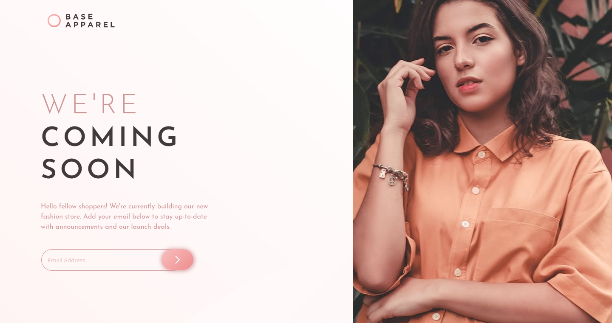

# Frontend Mentor - Base Apparel coming soon page solution

This is a solution to the [Base Apparel coming soon page challenge on Frontend Mentor](https://www.frontendmentor.io/challenges/base-apparel-coming-soon-page-5d46b47f8db8a7063f9331a0). Frontend Mentor challenges help you improve your coding skills by building realistic projects. 

## Table of contents

- [Overview](#overview)
  - [The challenge](#the-challenge)
  - [Screenshot](#screenshot)
  - [Links](#links)
- [My process](#my-process)
  - [Built with](#built-with)
  - [What I learned](#what-i-learned)
  - [Continued development](#continued-development)
  - [Useful resources](#useful-resources)
- [Author](#author)
- [Acknowledgments](#acknowledgments)
## Overview

### The challenge

Users should be able to:

- View the optimal layout for the site depending on their device's screen size
- See hover states for all interactive elements on the page
- Receive an error message when the `form` is submitted if:
  - The `input` field is empty
  - The email address is not formatted correctly


### Screenshot



### Links

- Solution URL: [Solution](https://github.com/AlexdelCarmen/four-card-feature-section)
- Live Site URL: [Live site](https://alexdelcarmen.github.io/four-card-feature-section/)

## My process

As usual, I created the HTML structure first, next I added some custom CSS styles, then proceeded to style the mobile layout for the website.  I ended with making a simple media query to support desktop layouts.  
### Built with

- Semantic HTML5 markup
- CSS custom properties
- Flexbox
- Mobile-first workflow
- Vanilla JavaScript. 

### What I learned

Kept using what I learned back in the article preview challenge and Lucas' tips to make sure the layout was looking good.  

```css

body {
  padding: 0;
  margin: 0;
  min-height: 100vh;
  display: flex;
  flex-direction: column;
  justify-content: center;
  align-items: center;
  background-color: var(--light1);
  font-family: var(--main-font);
  font-size: var(--para-size);
  color: var(--dark2);
}

.card-img {
    display: block;
    object-fit: cover;
    max-width: 100%;
    align-self: flex-end;
}

```

### Continued development

Still got to practice more my responsive layouts.  

- [W3Schools article on multiple backgrounds on an HTML element](https://www.w3schools.com/css/) - General CSS reference.


## Author

- Website - [Github Profile](https://github.com/AlexdelCarmen)
- Frontend Mentor - [@AlexdelCarmen](https://www.frontendmentor.io/profile/AlexdelCarmen)
- Twitter - [@AlekBorchov](https://twitter.com/AlekBorchov)

## Acknowledgments

To [Lucas](https://www.frontendmentor.io/profile/correlucas), thanks for the great tips.  
